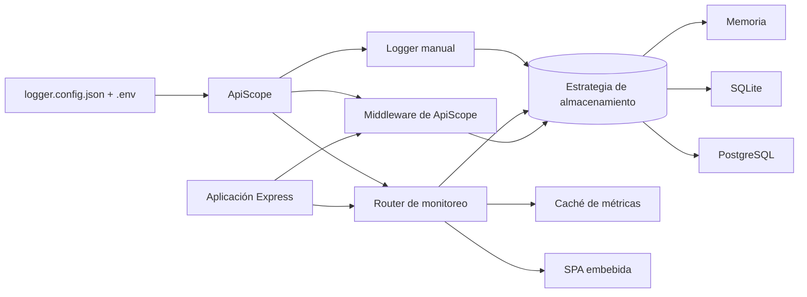

# Arquitectura

ApiScope se organiza alrededor de un conjunto pequeño de componentes estables:

## Módulos del backend

### `src/index.ts`

Punto de entrada. Construye la configuración resuelta, elige la estrategia de
almacenamiento, crea el `Logger` y expone la API pública usada por los
consumidores.

### `src/middleware/captureMiddleware.ts`

Middleware de Express que captura datos de request y response sin bloquear el
flujo de la petición.

### `src/storage/`

Contrato compartido de almacenamiento más las estrategias concretas:

- `MemoryStorage`: almacenamiento FIFO volátil.
- `SqliteStorage`: persistencia local con batching.
- `PostgresStorage`: almacenamiento de producción con pool.
- `StorageFactory`: selecciona la implementación según la config.

### `src/monitoring/`

Router de monitoreo, agregación de métricas, auth, filtros de request, caché y
serialización HTTP para la API web.

### `src/config/`

Carga `logger.config.json`, resuelve variables de entorno, aplica valores por
defecto y valida la forma final.

### `src/logging/Logger.ts`

API de logging manual (`logInfo`, `logWarning`, `logError`, `logDebug`).
Enmascara `metadata` con la misma lista `capture.sensitive_body_fields` que
usa el middleware de captura, así un log manual que reciba datos de un body
no filtra passwords u otros campos sensibles en texto plano.

### `src/utils/`

Utilidades compartidas para IDs, timestamps, enmascarado, detección de
callsite y tamaño de body.

## Modelo de datos

ApiScope almacena dos familias de registros:

- `RequestLogRecord`: automatic request/response capture.
- `ManualLogRecord`: explicit application logs.

Ambos viajan por la misma interfaz `StorageStrategy` para que el panel pueda
consultarlos juntos.

## Panel

El frontend vive en `frontend/` y compila a un único archivo HTML embebido. El
backend sirve ese archivo desde `GET /api/monitoring`.

La elección de compilación es intencional:

- un artefacto distribuible para la interfaz de monitoreo;
- sin dependencia en tiempo de ejecución de assets de CDN;
- despliegue simple en el consumidor del paquete.

El sistema visual vive en `frontend/src/styles/tokens.css` (paleta light/dark,
tipografía Inter, tokens de duración/easing) y `global.css` (utilidades
compartidas de animación, incluido `prefers-reduced-motion`).

## Decisiones de diseño

- La configuración usa snake_case en JSON y camelCase internamente.
- La paginación por cursor se implementa una vez y se reutiliza en todos los
  storages.
- Las métricas se cachean para reducir trabajo repetido de agregación.
- Los errores en la ruta de logging nunca escalan a la app anfitriona.
- La UI de monitoreo es estática en tiempo de ejecución y solo necesita el HTML embebido.